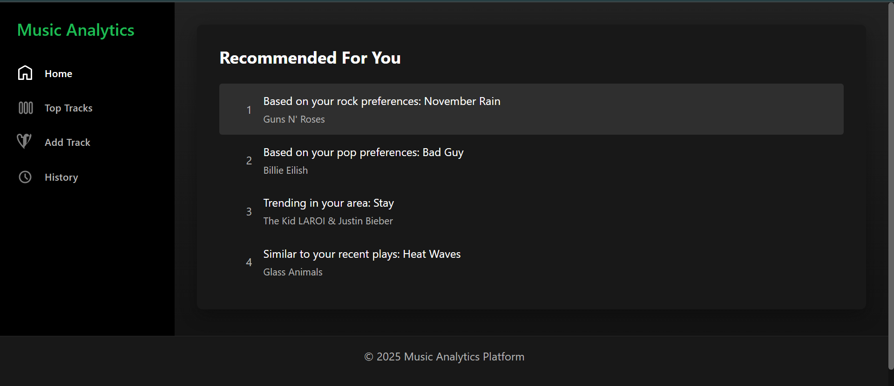
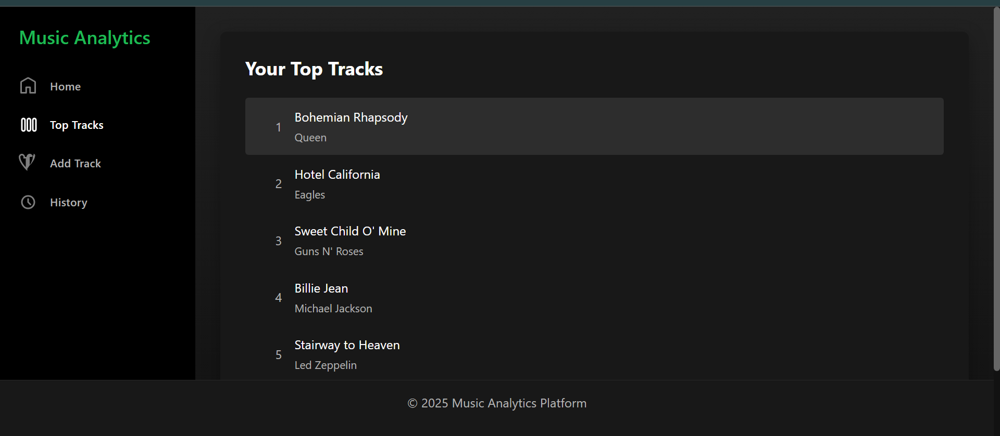
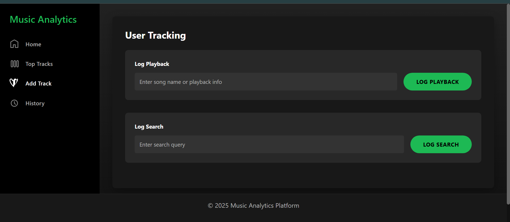

# Music Analytics Platform

A Spotify-like music analytics platform that provides music recommendations, tracks user listening history, and shows statistics. Built with Spring Boot microservices and React.

## Screenshots


*Home page showing music recommendations*


*Statistics page displaying top tracks*


*User activity tracking interface*

## Table of Contents
- [Project Overview](#project-overview)
- [Technologies Used](#technologies-used)
- [Running the Application](#running-the-application)
    - [Prerequisites](#prerequisites)
    - [Building and Running](#building-and-running)
- [Project Structure](#project-structure)
- [Key Features](#key-features)
- [Future Enhancements](#future-enhancements)
- [Contributing](#contributing)
- [License](#license)

## Project Overview

This platform consists of several microservices that work together to provide music analytics and recommendations:

- **Recommendation Service**: Suggests music based on user preferences and listening history
- **Statistics Service**: Analyzes listening patterns and generates usage reports
- **User Tracking Service**: Captures user interactions such as searches and playbacks
- **API Gateway**: Routes requests to appropriate services
- **Eureka Server**: Handles service discovery and registration
- **Frontend**: React-based user interface

## Technologies Used

- **Backend**: Java Spring Boot, Spring Cloud
- **Frontend**: React.js
- **Service Discovery**: Netflix Eureka
- **Container Orchestration**: Docker & Docker Compose

## Running the Application

### Prerequisites

- Java 17 or higher
- Node.js and npm
- Maven
- Docker and Docker Compose
- Windows users can use the `build_and_run.bat` script to automate the build and run process

### Building and Running

1. **Start the Service Registry (Eureka Server)**
   ```bash
   cd eureka-server
   mvn spring-boot:run
   ```

2. **Start the API Gateway**
   ```bash
   cd api-gateway
   mvn spring-boot:run
   ```

3. **Start the Microservices**
   ```bash
   # Start Recommendation Service
   cd recommendation-service
   mvn spring-boot:run

   # Start Statistics Service
   cd statistics-service
   mvn spring-boot:run

   # Start User Tracking Service
   cd user-tracking-service
   mvn spring-boot:run
   ```

4. **Start the Frontend**
   ```bash
   cd frontend
   npm install
   npm start
   ```

5. **Using Docker Compose**
   ```bash
   docker-compose up --build
   ```

6. **Using the `build_and_run.bat` script (Windows)**
   ```bash
   build_and_run.bat
   ```

## Accessing the Application

- Frontend Application: http://localhost:3000
- Eureka Dashboard: http://localhost:8761
- H2 Database Console (User Tracking): http://localhost:8084/h2-console
  - JDBC URL: jdbc:h2:mem:usertrackingdb
  - Username: sa
  - Password: (leave empty)

## Project Structure

The application follows a standard microservice architecture:

```
MusicAnalyticsPlatform/
├── api-gateway/           # API Gateway service
├── eureka-server/         # Service discovery
├── recommendation-service/ # Music recommendation logic
├── statistics-service/     # Analytics and statistics
├── user-tracking-service/ # User behavior tracking
├── frontend/              # React-based UI
└── docker-compose.yml     # Container orchestration
```

## Key Features

- Music recommendation engine
- User activity tracking
- Listening statistics and analytics
- Microservices architecture with service discovery
- Containerized deployment

## Future Enhancements

- User authentication and profiles
- Machine learning-based recommendation engine
- Extended analytics dashboard
- Mobile application

## Contributing
Contributions are welcome! Please fork the repository and submit a pull request.

### Guidelines for Contributors
1. Fork the repository and create your branch from `main`.
2. If you've added code that should be tested, add tests.
3. Ensure the test suite passes.
4. Make sure your code lints.
5. If you haven't already, complete the Contributor License Agreement ("CLA").

## License
This project is licensed under the MIT License. See the [LICENSE](./LICENSE.txt) file for details.
